### fMRI depends on $T_{2}^{*}$ contrast

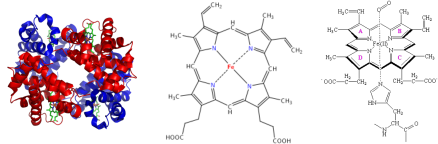

- An fMRI time-course is formed by the rapid acquisition of MR images that are sensitive to the "blood oxygen level dependent" (BOLD) contrast <!-- .element: class="fragment" data-fragment-index="1" -->
- Hemoglobin, the protein which transports oxygen in the blood, contains four heme molecules, each with an atom of iron <!-- .element: class="fragment" data-fragment-index="2" -->
- Deoxy-hemoglobin is paramagnetic and creates a magnetic gradient that dephases the MRI signal<!-- .element: class="fragment" data-fragment-index="3" -->
- Oxy-hemoglobin is diamagnetic and does not affect the MRI signal<!-- .element: class="fragment" data-fragment-index="4" -->

---

## Hemodynamic response

<figure>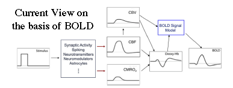<small><figcaption>R.B. Buxton, NeuroImage 62 (2012) 953-961.</small></figcaption></figure>

It is not know for certain how the hemodynamic response is triggered or the phsyiological mechanisms behind its shape, but a model is emerging from experimental evidence.    

1.	Initially neurons begin firing in response to a stimulus and consumes locally stored metabolites and oxygen, increasing the amount of deoxy-hemoglobin which decreases the MR signal
2. 	The body is instructed to increase blood flow to the area (via astrocytes?)
3. 	The rate of extraction of oxygen from blood (and oxygen metabolism) is slower than the blood flow, resulting in a net increase in oxygenated blood, and a MR signal increase
4. 	After neuronal activity ceases, the signal returns to baseline after a brief undershoot

---

# fMRI Data #

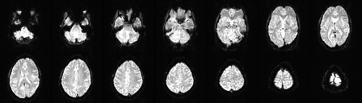

- fMRI data are acquired using $T_{2}^{*}$ weighted gradient-echo EPI sequences
- The optimal $T_{E}$ for BOLD is 45ms at 1.5T and 30ms at 3T
- Spatial resolution is typically ~ $3 \times 3 \times 3 mm^3$
- $T\_{R}$ depends on the number of slices acquired (~ 60ms per slice)
    ~ 120mm typically needed to cover entire brain, 40 slices, $T_{R} \approx 2500ms$  

---

# fMRI Experiment

<figure>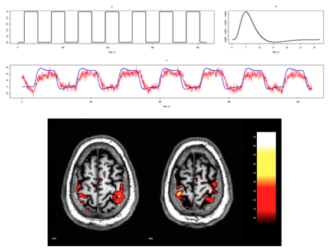<figcaption><small>Finger tapping experiment.</small></figcaption></figure>

---

# Resting State Functional Connectivity

<figure>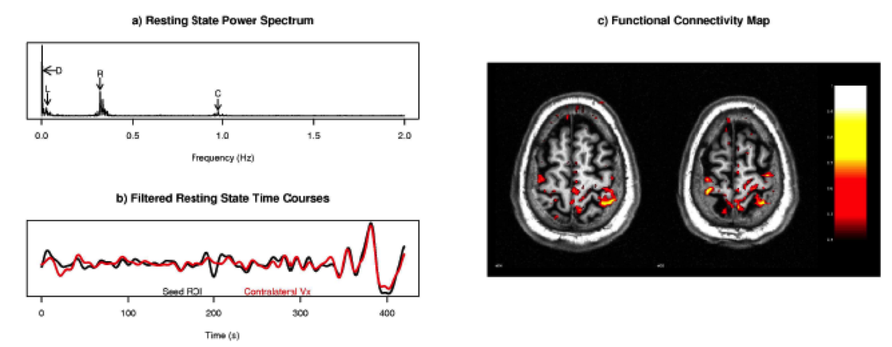<figcaption><small>Biswal et al. MRM 1995.</small></figcaption>

- Intrinsic activity is "ongoing neural and metabolic activity which is not directly associated with subjects’ performance of a task" - Raichle TICS 2010

---

# Intrinsic Connectivity Networks

    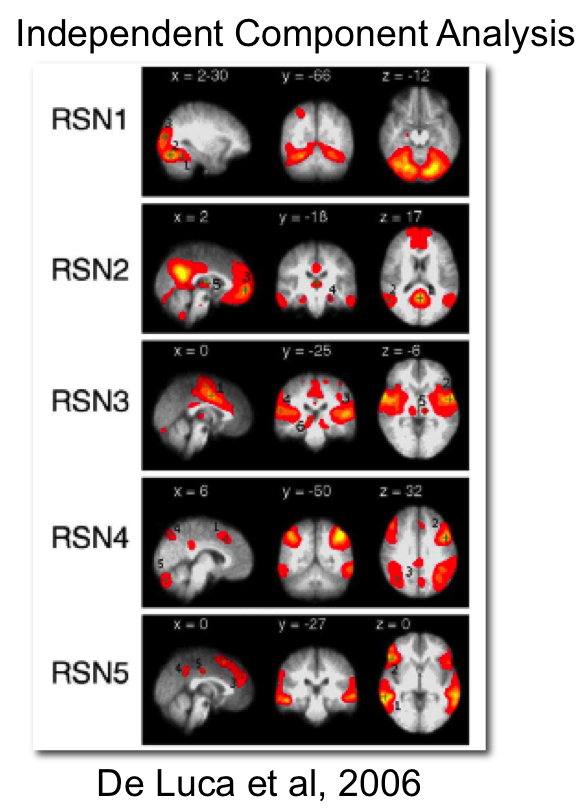
    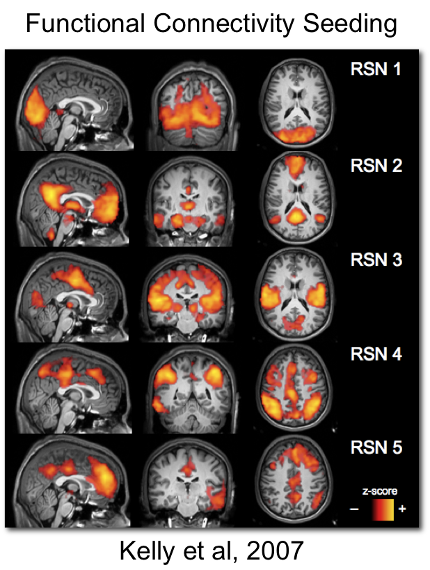

---

## Spontaneous fluctuations contain meaningful signal ##

note: Biswal 1995

## Mapping functional interactions with fMRI ##

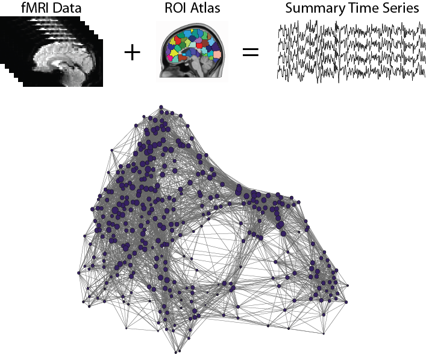

---

# Functional Connectivity Analysis

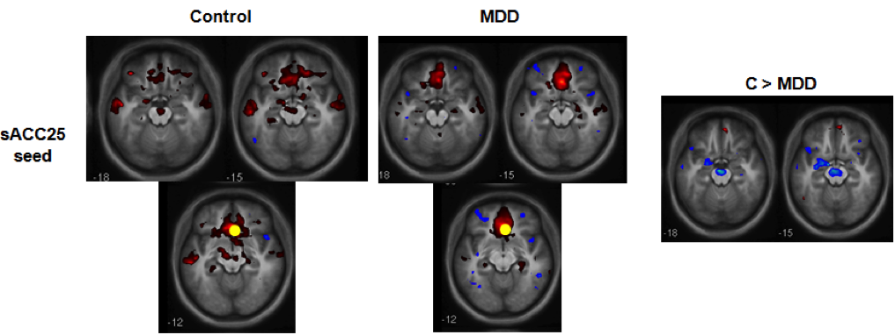

- A "typical" resting state FC experiment comparing two groups

1. Data are preprocessed to make the comparable across participants and to remove noise
2. Indiviudal level FC maps are generated for a *seed* region by correlating the *seed time course* with the time course of every other voxel in the brain
3. FC maps are compared between groups voxel-by-voxel using t-tests or ANOVAs

---

# Functional Preprocessing

1. Slice timing correction
2. Motion correction
3. Calculate EPI - T1 transform
4. **Nuisance variance regression**
    - Linear and quadratic drifts
**  - Physiological signals or WM and CSF**
    - Motion parameters (6 or 24 regressor model)
5. **Bandpass filtering**
6. Copy into MNI space
7. Spatial smoothing

---

# Physiological Noise

- The brain pulses with the heart beat, which results in motion artifacts, and intensity modulations - can be measured in CSF and at sagittal sinus
- The rise and fall of the abdomen in the magnetic field induces global intensity modulations, and the changes in depth and rate of breathing result in changes to brain oxygenation level
- Both of these noise sources can be modeled from recordings of heart rate (pulse oximeter) and respiration (respiratory belt), and regressed from the signal (PhysioFix, Retroicor)
- Due to difficulties collected physiological recordings in the scanner, the signal from white matter and CSF are commonly regressed from the signal to account for this variance
    - WM and CSF are determined using tissue masks derived from anatomical image
    - white matter is a surrogate for respiratory effects
    - CSF is a surrogate for heart rate effects
    - Can use multiple regressors that account for spatial variation in the signal (AnatIcorr, CompCor)
  
- Global signal is sometimes included as a non-specific surrogate for noise, but has become unpopular since it can introduce negative correlations

---

# Nuisance Variable Regression

'Nuisance signals' ($\eta$) can be removed from the voxel time course ($y_t$)  
using a regression model

$$ y_t = \beta^T{\eta}_t + {\varepsilon}_t $$

- The residuals of the model ${\varepsilon}_t$ are the cleaned time courses

---

# Bandpass Filtering

- The resting state fMRI phenomenon is thought to be centered in the frequencies 0.001 Hz to 0.08 Hz, as a result it is common to apply a bandpass filter to the data to restrict the frequencies to this range
- This doesn't remove much noise, because it is smeared throughout the frequency range
- Many researchers now recommend to not use filtering, since their may be higher frequency information present in the data
- Filtering should be performed after nuisance signal regression

---

# Finally

- Now that the data is de-noised it is ready to use
- The data is written into standard space

---

# Networks 

---

# Clustering #

---

# Graph theory #

---

# Leftover from fMRI lecture

- Constructing *brain areas* (Regions of Interests, ROIs) using clustering algorithms
- Measuring functional interactions between brain areas

---

# Brain Areas

<figure>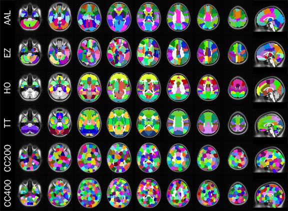<figcaption><small>Different atlases for defining connectome nodes. Craddock et al., Nature Methods, 2013</small></figcaption></figure>

- To construct a *connectome graph*, you must first choose the areas to use as *graph nodes*
- Voxels are a logical choice, but will result in very large connectomes
- Alternatives are to use brain atlases derived from cytoarchitectonics, cortical landmarks, or from clustering data

---

# Brain Areas

<figure>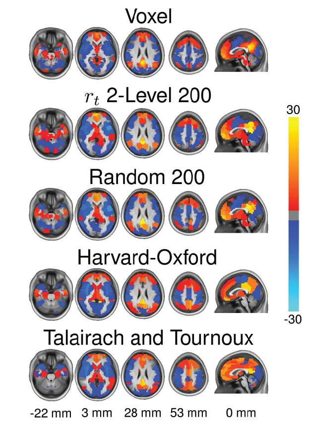<figcaption><small>Different atlases provide different FC results. Craddock et al., Human Brain Mapping, 2011</small></figcaption></figure>

- Anatomical atlases provide good *interpretability* but may not accurately fit brain function
- Best to derive brain areas from the data (can be done with functional and structural data)

--- 

# Clustering Brain Data

1. Preprocess the data
2. Construct *affinity matrix* for each dataset
    - $N_{vox} \times N_{vox}$ matrix where each entry corresponds to the similarity of the voxel's time course (fMRI), or connectivity pattern (fMRI or dMRI)
    - Constrain connectivity to just neighboring voxels
3. Cluster individual data
    - Several different clustering algorithms can be used
4. Combine clustering solution across datasets
    - Create affinity matrix for each clustering solution, where similarity is 1 if two voxels are in the same cluster, and 0 otherwise
    - Average affinity matrices across datasets
5. Perform group level clustering
6. Determine optimal number of clusters
    - Calculate clustering solutions with different numbers of clusters
    - Compare solutions to find the best
    
---

# Finding the optimal number of clusters

- Distortion index, silhouette, leave-one-out cross validation, representational accuracy
- No clear best solution, instead there is a continuum of solutions to choose from

<figure>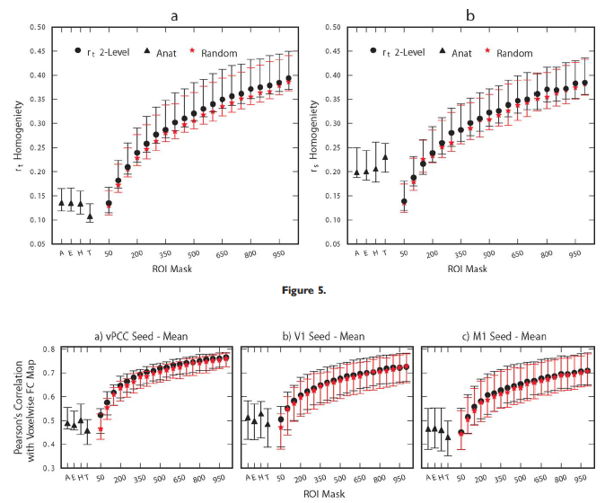<figcaption><small>Evaluation of different clustering solutions. Craddock et al., Human Brain Mapping, 2011</small></figcaption></figure>

--- 

# Creating Edges

- Function interactions are typically measured using **Pearson's correlation**, although many other methods have been proposed $$\rho(v_i,v_j)=\frac{1}{T-1}\sum\limits_{t=0}^{T}\frac{(v_{i}[t]-\mu_{i})(v_{j}[t]-\mu_{j})}{\sigma_{i}\sigma_{j}}$$
    - $v_i[t]$ and $v_j[t]$ are the time courses for the $i^{th}$ and $j^{th}$ brain areas, respectively
    - $T$ is the number of samples in a time course
    - $\mu_i$ and $\mu_j$ are the means of the $i^{th}$ and $j^{th}$ brain areas
    - $\sigma_i$ and $\sigma_j$ are the standard deviations of the $i^{th}$ and $j^{th}$ brain areas

----

# Other Methods

<figure>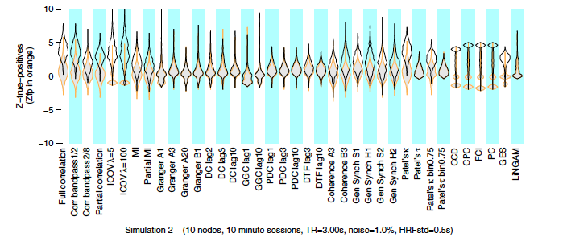<figcaption><small>Comparison of different methods for calculating functional relationships. Smith et al., NeuroImage, 2011</small></figcaption></figure>

---

#Comparing connectomes

- Once we have a connectome graphs for a set of individuals, the next challenge is comparing them
    - Identify connections withen the graph, or subgraphs, that vary with disease state or other phenotype

    

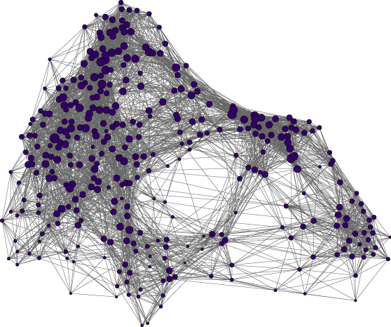

---

# What is a graph?

- Mathematical description of the relationship between ``things''
- Consists of nodes and edges
- Nodes correspond to brain areas
- Edges correspond to connections between brain areas
    - structural connections from dMRI
    - functional interactions from fMRI
- Graphs derived from fMRI and dMRI data can be treated similarly, except for a few exceptions    
    
---

# Weighted and binarized

- Edges in a weighted graph are annotated with a weight that corresponds to the edge strength
- No such weighting is used with binarized graphs

<figure>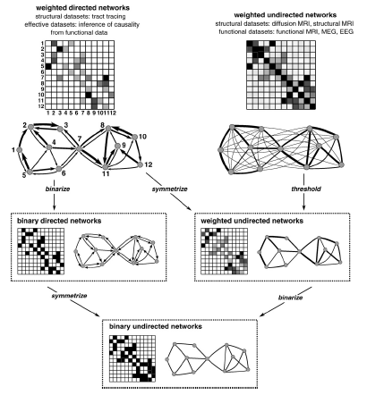<figcaption><small>Rubinov and Sporns, *NeuroImage*, 2010.</small></figcaption></figure>

---

# A note about Thresholding

- Although, every node *could* be connected to every other node, this is not likely the case
- Use thresholding to remove unlikely connections due to poor strength or likelihood of error
- Thresholding is also necessary for binarizing connections
- **Sparsity threshold**: keep only a fraction of the strongest connections
- **Significance threshold**: remove edges that may have arisen by chance
- Although negative correlations can and do arise in functional connectivity, they are hard to interpret in a graph sense and are often removed
     

---

# Bag of edges

- The most obvious is to perform a *univariate* test on each connectome of the graph
    - Allows commonly employed statistical tests such as t-tests and general linear models to be employed 
- The result is a very large number of connections $\frac{N_{vox}*(N_{vox}-1)}{2}$ 
    - 19 900 connections when $N_{vox}=200$
- As a consequence, their will be a large number of *false positives* unless a control for multiple comparisons in employed
    - Bonferroni Correction, False Discovery Rate (FDR), Groupwise FDR, Network Based Statistic

---

# Prediction Modeling

- Another option for *bag of edges* style analyses take into account interactions between features
- Also, estimate the significance of an identified pattern differences based on $p(\text{disease state}|\text{pattern})$ rather than $p(\text{pattern}|\text{NULL})$

---

# Classification

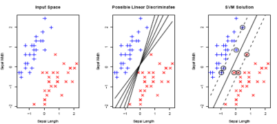

- Given a training set of observations and corresponding (categorical) labels, the objective is to find a linear hyperplane that is capable of separating observations from different categories
- For linearly seperable data there are an infinite number of hyperplanes that meet this requirement
- **Support Vector Classification** finds the unique hyperplane that maximizes the perpendicular distance from the hyperplane to the nearest observations of a class (**margin**)

---

# Train vs. Test

- Training is the process of solving a mathematical algorithm to learn a classifier
    - Requires: Data + Labels
    - Results: Model
- Testing involves applying the classifier to a never-before-seen dataset to estimate *prediction accuracy* (or *generalization error*)
- Test and training datasets should be independent to avoid biased estimates of prediction accuracy

---

# Bag of Edges Predictive Modeling

<figure>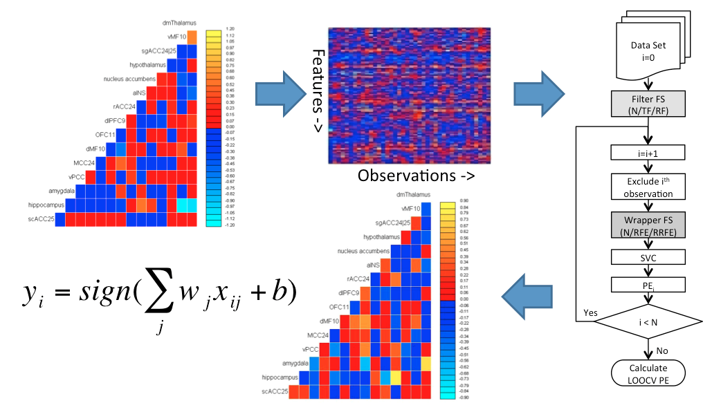<figcaption>Craddock et al. *Magnetic Resonance in Medicine* 2009. </figcaption></figure>

---

# Feature Selection

- Filter methods: Perform a univariate test at each edge and only include those that pass a liberal threshold (univariate criterion that is not sensitive to multivariate relationships)
- Reliability Filter: Estimate bootstrap confidence intervals and exclude features whose 95% CI include zero 

<figure>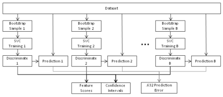<figcaption>Craddock et al. *Magnetic Resonance in Medicine* 2009. </figcaption></figure>

---

# Connectome Wide Association Studies

<figure>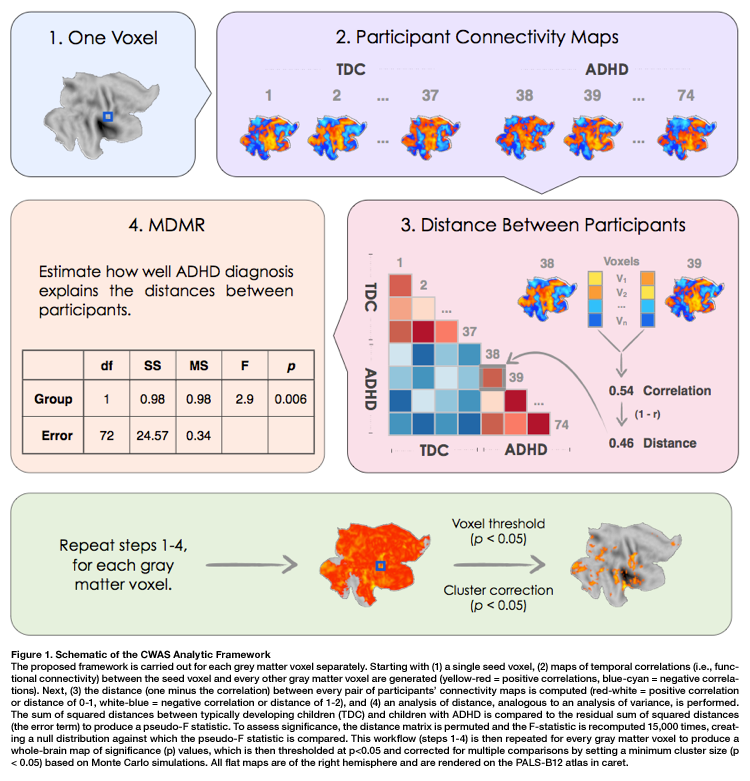<figcaption><small>Shehzad et al. *NeuroImage*, 2014.</small></figcaption></figure>

---

# Graph Invariants

- As an alternative, we can reduce the number of tests to one per node or one per graph using **graph invariants** (complex network measures)
- Graph invariants: a property of a graph that does not depend on the graphs represtation or orientation
- The same graph can be represented in many different ways

<figure>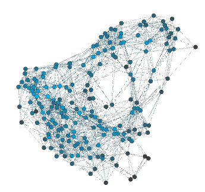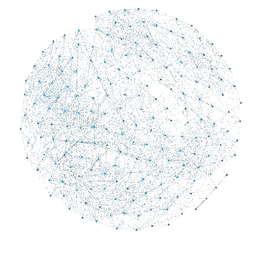<figcaption><small>The same graph arranged in two different ways. Created with Gephi.</small></figcaption></figure>

--- 

# Node Centrality (Hubbiness)

- The relative importance of a node in a network, determined by its connections
- **Degree**: Number of links connected to a node
- **Closeness Centrality**: the average of the inverse distance from the node to all other nodes
- **Betweenness Centrality**: the average length of all shortest paths that pass through a node
- **Eigenvector**: average of the centrality measures for the nodes that a target node is connected to 
- **Pagerank Centrality**: derives a score based on the number and centrality of the nodes a target node is connected to (Google's algorithm)

---

# Efficiency

- Efficiency is a measure of how quickly information can travel between any two nodes in a network
- **Global efficiency**: The average inverse shortest distance between every two points in a network
- **Local efficiency**: the inverse of the average shortest path connecting all neighbors of a vertex.

---

# Small Worldness

- Small world graphs, are graphs in which nodes can be quickly reached from every other node by a small number of hops, although the number of edges between nodes is minimized
- **Clustering Coefficient (C)**: the number links that exist between a node and its neighbors, divided by all possible links to neighboring nodes
- **Characteristic Path Length (L)**: The average of all shortest paths in the network
- **Small worldness** of a network is $S=\frac{\frac{C}{C_{rand}}}{\frac{L}{L_{rand}}}, where $C_{rand}$ and $L_{rand}$ are the clustering coefficient and characteristic path lengths that would have been obtained from randomly generated graphs with the same number of nodes and edges.
- if *S>1.0* the graph is said to be ``small world'' which means that 
    - its clustering coefficient is higher then expected from a random graph (resilient to point attacks) 
    - its average path length is shorter than expected from a random graph (efficient)
    
---

# Functional vs. Structural

- Since functional interactions do not imply a route or wire between connected regions, path measures don't make since for these graphs
    - i.e. the fact that A is connected to B and B is connected to C does not imply that information can travel from A to C, if A and C were where functionally connected, their activity would be correlated
- This is not the case for structural graphs

--- 

# Example: Small Worldness in Schizophrenia

<figure>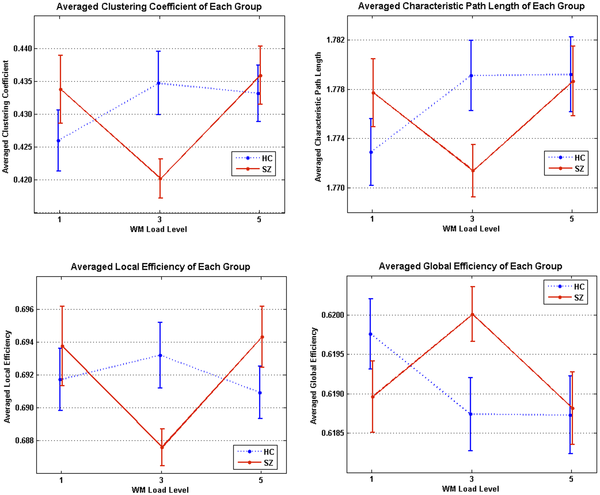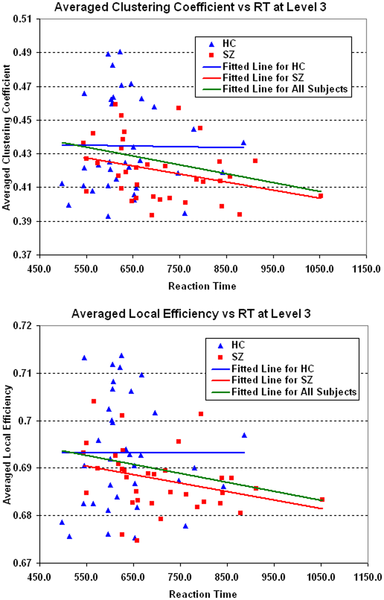<figcaption><small>Small world properties of funcitonal connectivity networks differ between healthy controls and schizophrenics. He et al. *PLoS One* 2012. </small></figcaption></figure>

